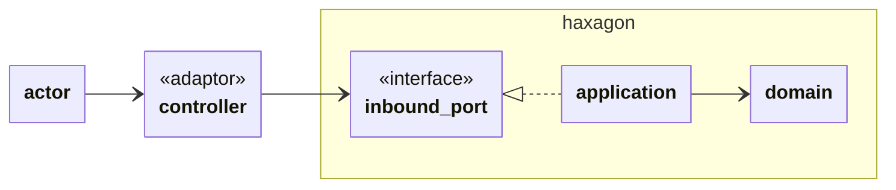
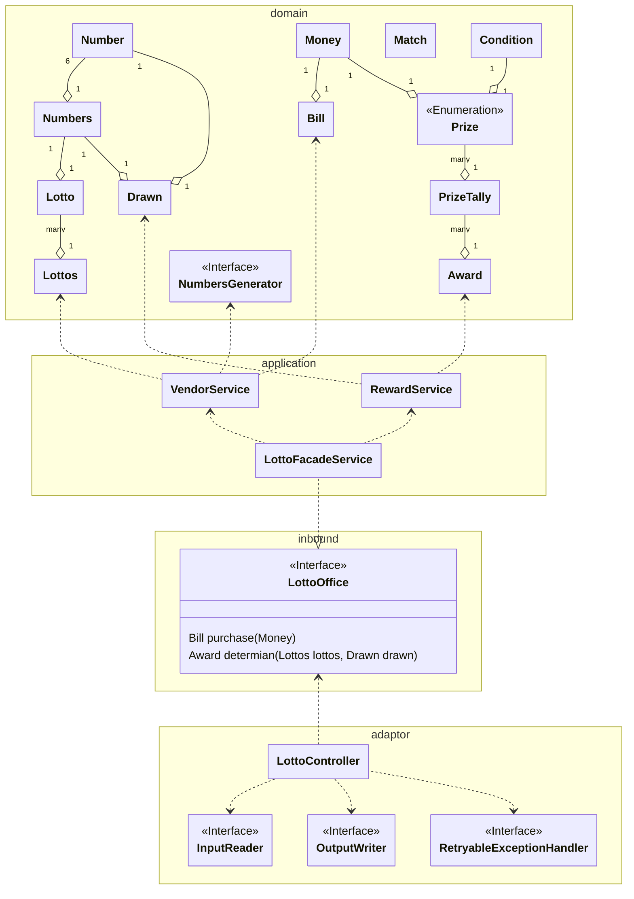

# java-lotto-precourse

우아한테크코스(Woowa Tech Course) 웹 백엔드 8기 2주 차 프리코스 과제 : 로또
---

### 회고

정리된 문서 : [reaction_paper.md](docs/reaction_paper.md)

---

### 요구사항분석

요구사항 문서 : [mission.md](docs/mission.md)

- 과제 진행 요구사항
    - 이슈 없음
- 기능 요구 사항
    - 스스로 추가한 요구사항
        - 수익률 천단위 구분자 적용한다
        - 구입금액이 0원 인경우 예외 후 재입력 한다
        - 보너스 번호가 당첨번호와 겹치지 않도록 한다
- 프로그래밍 요구 사항
    - 사용자가 잘못된 값을 입력할 경우 IllegalArgumentException을 발생시키고, "[ERROR]"로 시작하는 에러 메시지를 출력 후 그 부분부터 입력을 다시 받는다.
    - Exception이 아닌 IllegalArgumentException, IllegalStateException 등과 같은 명확한 유형을 처리한다.

---

### 기능 목록

| ID | 카테고리  | 기능 이름 한글      | 기능 이름 영어                       | 설명                                                                                              |
|----|-------|---------------|--------------------------------|-------------------------------------------------------------------------------------------------|
| 1  | 예외 복구 | 잘못 입력시 재입력 받음 | retry input when wrong input   | "[ERROR]"로 시작하는 에러 메시지를 출력 후 그 부분부터 입력을 다시 받는다.                                                 |
| 2  | 입력    | 구입금액 입력       | input money                    | 구입 금액은 1,000원 단위로 입력 받으며 1,000원으로 나누어 떨어지지 않는 경우 예외 처리한다. 구입금액이 0원 인경우 예외 후 재입력한다.              |
| 3  | 처리    | 랜덤 로또 번호 생성   | generate random lotto number   |                                                                                                 |
| 4  | 출력    | 발행한 로또 수량 출력  | output purchased lotto amount  |                                                                                                 |
| 5  | 출력    | 발행한 로또 번호 출력  | output purchased lotto numbers | 로또 번호는 오름차순으로 정렬하여 보여준다.                                                                        |
| 6  | 입력    | 당첨 번호 입력      | input lucky numbers            | 번호는 쉼표(,)를 기준으로 구분한다.                                                                           |
| 7  | 입력    | 보너스 번호 입력     | input bonus number             | 당첨번호와 겹칠 경우 재입력                                                                                 |
| 8  | 처리    | 당첨 계산         | evaluate award                 |                                                                                                 |
| 9  | 출력    | 당첨 내역 출력      | output award result            | 순위 오름차순  (양식은 참조)                                                                               |
| 10 | 출력    | 총 수익률 출력      | output return rate             | "총 수익률은 62.5%입니다." 수익률은 소수점 둘째 자리에서 반올림한다. (ex. 100.0%, 51.5%, 1,000,000.0%), 수익률 천단위 구분자 적용한다. |

### 오류

- 로또 구입 금액이 나누어 떨어지지 않는 경우
- 구입 금액이 0인 경우
- 숫자가 아닌 번호 입력
- 번호 범위 초과
- 번호 중복
- 당첨번호가 6개가 아님
- 보너스 번호가 1개가 아님

### 도메인 모델 분석

**도메인 모델 도출**

| 이름    | 영어이름        | 설명                                 |
|-------|-------------|------------------------------------|
| 금액    | money       | 0 이상의 숫자를 가짐                       |
| 번호    | number      | 숫자 범위는 1~45까지                      |
| 번호들   | numbers     | 6개의 번호를 가짐  중복이 안됨                 |
| 로또    | lotto       | 번호들을 가짐, 가격을 가짐                    |
| 로또 묶음 | lottos      | 로또를 여러개 가짐                         |
| 영수증   | bill        | 구입 금액과 발행한 로또 묶음을 가짐               |
| 당첨 번호 | drawn       | (당첨)번호들과 (보너스)번호를 가짐               |
| 일치    | match       | 당첨번호 일치 갯수, 보너스 번호 일치 여부를 가짐       |
| 조건    | condition   | 당첨번호 일치 필요 갯수, 보너스 번호 일치 필요 여부를 가짐 |
| 당첨    | prize       | 등수, 조건, 상금(금액) 을 가짐                |
| 당첨 집계 | prize tally | 각 당첨 개수를 기록                        |
| 수상    | award       | 당첨집계를 모으고 총 금액을 집계 가능              |

### 인수테스트 케이스

| ID | 제목        | 재현될 상황                     | 예상되는 결과                 |
|----|-----------|----------------------------|-------------------------|
| 1  | 1등        | 1장의 구입을 통해 1등에 당첨됨         | 당첨결과 출력                 |
| 2  | 2등        | 1장의 구입을 통해 2등에 당첨됨         | 당첨결과 출력                 |
| 3  | 3등        | 1장의 구입을 통해 3등에 당첨됨         | 당첨결과 출력                 |
| 4  | 4등        | 1장의 구입을 통해 4등에 당첨됨         | 당첨결과 출력                 |
| 5  | 5등        | 1장의 구입을 통해 5등에 당첨됨         | 당첨결과 출력                 |
| 6  | 미당첨       | 1장의 구입을 통해 미당첨             | 0.0% 수익률 출력             |
| 7  | 혼합당첨      | 3장의 구입을 통해 5등과 4등 당첨       | 당첨결과와 1,833.3% 수익률 출력   |
| 8  | 5등        | 8장의 구입을 통해 5등 당첨           | 당첨결과와 62.5% 수익률 출력      |
| 9  | 구입금액 오류   | 문자, "0", "1001","1000j" 입력 | [ERROR] 로 시작하는 오류메세지 출력 |
| 10 | 당첨번호 오류   | 문자, 5개 , 범위초과 , 중복번호 입력    | [ERROR] 로 시작하는 오류메세지 출력 |
| 11 | 보너스 번호 오류 | 당첨번호와 중복번호 입력              | [ERROR] 로 시작하는 오류메세지 출력 |

---

### 아키텍쳐 다이어그램

---

### 이번 설계에서 고민한 것

- 재입력처리 흐름제어와 에러 메세지 출력을 어떻게 효율적으로 할 것인가?
- 재사용성이 높으면서 크게 복잡하지 않은 도메인 모델을 어떻게 도출하고 구조화 할것인가?
- 각 도메인 모델이 어떻게하면 맥락상 최소한의 메서드만 가질 수 있는가?
- 예외 메세지는 누가 가지고 있어야하나?

---

### 클래스 다이어그램

